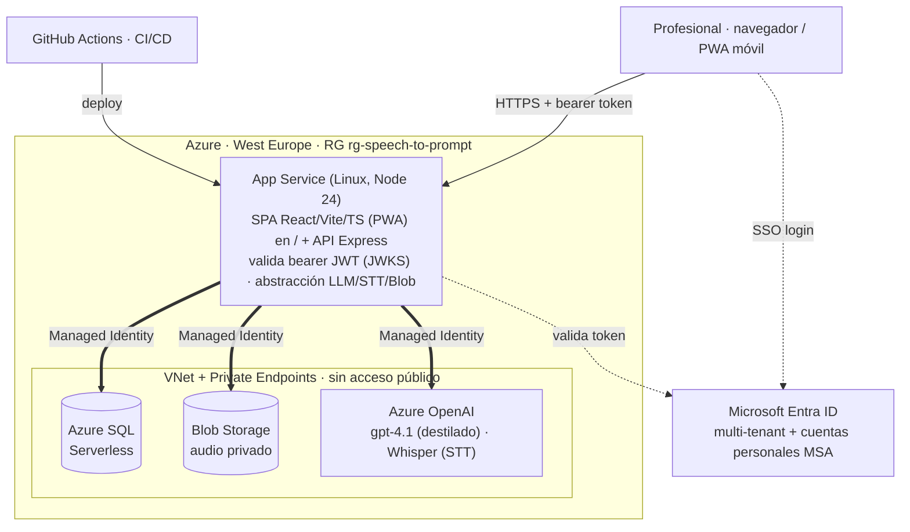
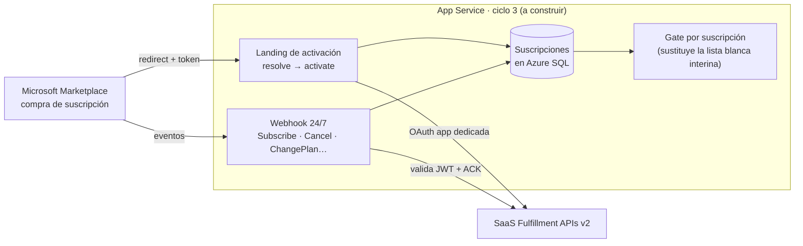

# Arquitectura Speech-to-prompt (fuente del diagrama)

Fuente editable de los diagramas (Mermaid; renderiza en VS Code / GitHub). Para la reunión ISV Success del 23-jul. Versión presentable: artefacto HTML publicado aparte.

## 1. Arquitectura actual (en producción · 100% Azure · secretless)

**Claves:** identidad Entra multi-tenant + MSA (login de un clic con cualquier cuenta Microsoft) · datos y modelos **solo alcanzables por red privada** (Private Endpoints) · la app se autentica contra SQL/Blob/Azure OpenAI con **Managed Identity** (sin secretos) · procesadores **first-party de Azure** (facturables contra crédito).

## 2. Integración Marketplace — ciclo 3 (a construir)

**Claves:** fulfillment **nativo** en nuestro backend Node (no SaaS Accelerator) · el **gate por suscripción** reemplaza la lista blanca de correos actual · ⚠️ decisión abierta: la app de Entra del fulfillment pide *client secret* → buscamos alternativa **secretless** (credencial federada).
